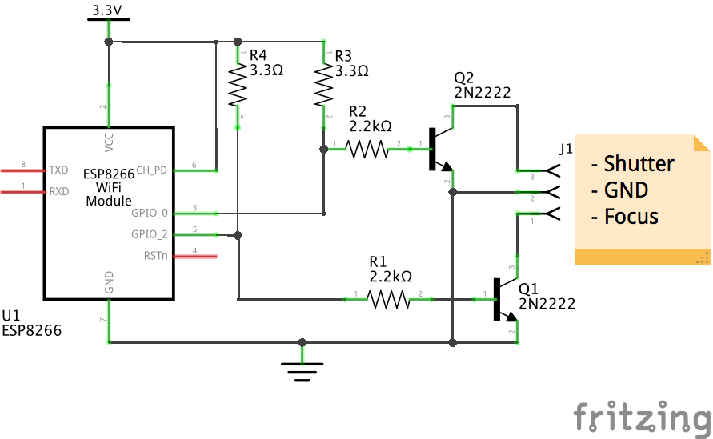

Camera WiFi Remote Module
=========================

CWRM stands for _Camera WiFi Remote Module_. It is a ESP8266-based device that
allows to trigger the focus/shutter of a camera. It is in **early stage** but it
works.

## Schematic

Note: the schematic below assumes the presence of a 3.3V power supply for the
WiFi module. This will evolve soon to use a battery (along with a voltage
regulator) in order to make the module fully autonomous.

### Parts

- 1 x ESP8266-01 (_U1_)
- 2 x 2.2k ohms (_R1_ and _R2_)
- 2 x 2N2222 (_Q1_ and _Q2_)
- 2.5mm male stereo plug (connected to _J1_)
- 3.3V power supply

## License

CWRM is released under the MIT License. See the bundled LICENSE file for
details.
