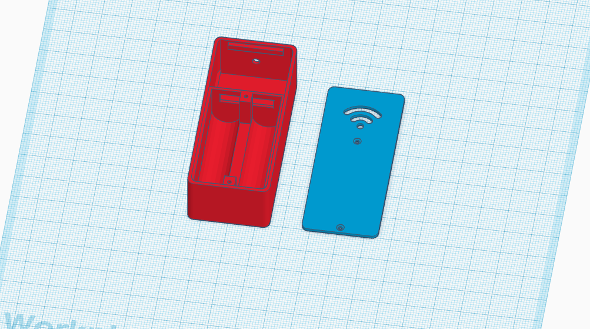
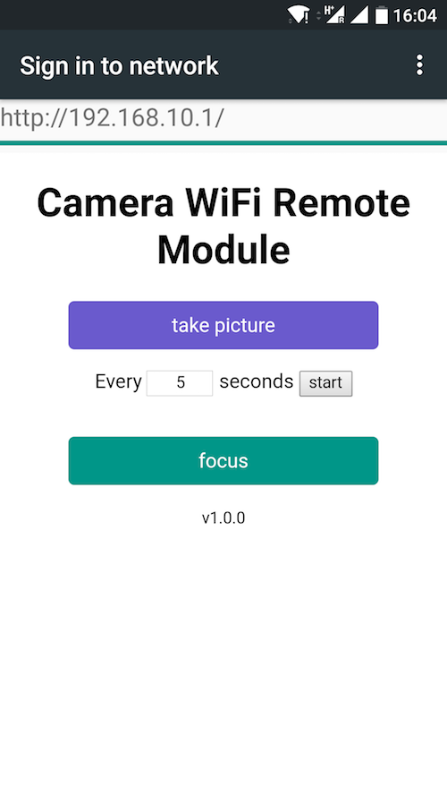

Camera WiFi Remote Module
=========================

CWRM stands for _Camera WiFi Remote Module_. It is a ESP8266-based device that
allows to trigger the focus/shutter of a camera _via_ WiFI. It is in **early stage**
but it works with my Canon camera™.

    

## Schematic

    

### Parts

- 1 x ESP8266-01 (_U1_)
- 2 x 2.2k ohms (_R1_ and _R2_)
- 2 x 3.3k ohms (_R3_ and _R4_)
- 2 x 2N2222 (_Q1_ and _Q2_)
- 2.5mm male stereo plug (connected to _J1_, for Canon cameras)
- 3.3V power supply (like 2 AAA batteries)

## Case

A STL file is provided to 3D-print a case for this module. It costs ~20 euros
on Shapeways.

    

## Software

The module creates its own WiFi network, and then acts as a captive portal,
redirecting everything to `192.168.10.1`. A simplistic web page is served to
control the camera.

    

### Development

The source code can be found in the `cwrm/` folder (Arduino IDE requires the
same name for both the main sketch and its directory). You can compile the
firmware using `make` (recommended):

    $ make clean
    $ make

By default, it is compiled for release purpose. You can also compile a debug
version with:

    $ make debug

You will need [html-minifier](https://github.com/kangax/html-minifier) installed
to compile the HTML code and generate the `cwrm/cwrm_generated.h` file:

    $ npm install html-minifier -g
    $ make compile-html

This project uses the following libraries/tools:

- AJAX lib: https://github.com/yanatan16/nanoajax
- Makefile: https://github.com/plerup/makeEspArduino
- CI build: https://github.com/adafruit/travis-ci-arduino

## Similar projects

- https://guillermoamaral.com/read/canon-wifimote/

## License

CWRM is released under the MIT License. See the bundled LICENSE file for
details.
